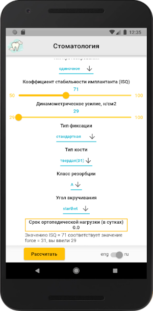

# DentApp

Repository: [https://github.com/sv-makh/dent-app](https://github.com/sv-makh/dent-app)

Приложение-калькулятор для расчёта срока ортопедической нагрузки. 
Расчёт производится на сервере, взаимодействие с сервером по REST API.

Скриншоты:

 