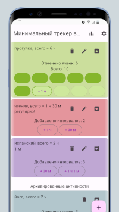
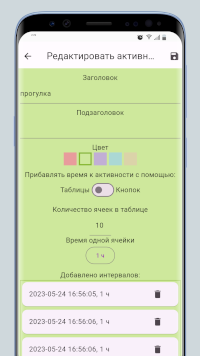
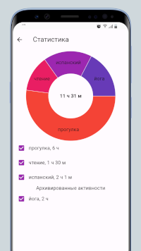
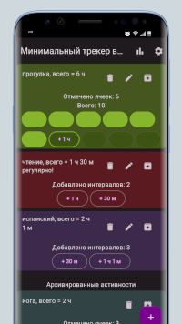
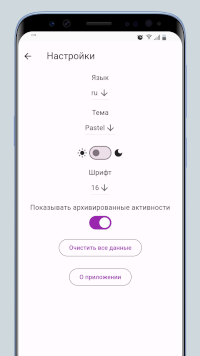
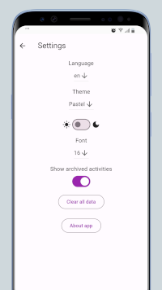

# Minimal time tracker

Repository: [https://github.com/sv-makh/minimal_time_tracker/](https://github.com/sv-makh/minimal_time_tracker/)

| | |
|-|-|
||Приложение выложено в RuStore: [https://apps.rustore.ru/app/com.mtt.minimal_time_tracker](https://apps.rustore.ru/app/com.mtt.minimal_time_tracker)|

Проект является приложением-трекером для отслеживания времени, затраченного на различные активности. Данные хранятся локально - в базе данных Hive, а настройки - в Shared preferences.

Функциональность:
- добавление активностей, добавление временных интервалов к ним
- редактирование данных существующих активностей
- добавление активностей в архив, который можно скрыть
- статистика для всех выбранных активностей в виде pie chart
- изменение темы, светлого/тёмного режима, языка (ru/en), размера шрифта

Скриншоты:

     