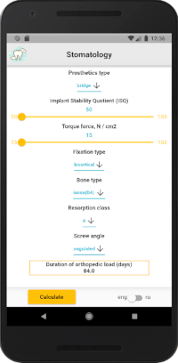
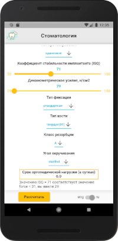
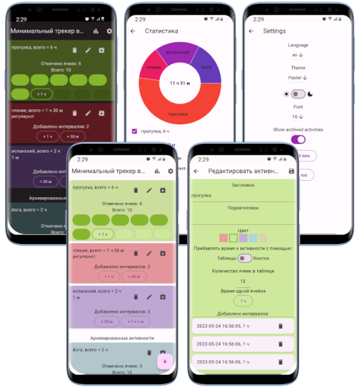
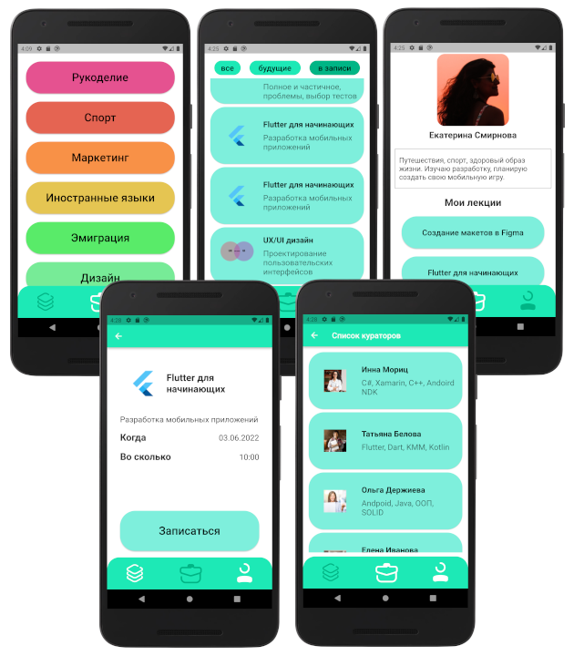

# Portfolio

GitHub: [sv-makh](https://github.com/sv-makh/)

## *Projects*

- [Dent-App](#dentapp)
- [Minimal time tracker](#minimal-time-tracker)
- [ShEx](#shex---share-experience)

## DentApp

Repository: [https://github.com/sv-makh/dent-app](https://github.com/sv-makh/dent-app)

Приложение-калькулятор для расчёта срока ортопедической нагрузки. 
Расчёт производится на сервере, взаимодействие с сервером по REST API.

Скриншоты:

 

## Minimal time tracker

Repository: [https://github.com/sv-makh/minimal_time_tracker/](https://github.com/sv-makh/minimal_time_tracker/)

| | |
|-|-|
||Приложение выложено в RuStore: [https://apps.rustore.ru/app/com.mtt.minimal_time_tracker](https://apps.rustore.ru/app/com.mtt.minimal_time_tracker)|

Проект является приложением-трекером для ослеживания времени, затраченного на различные активности. Данные хранятся локально - в базе данных Hive, а настройки - в Shared preferences.

Функциональность:
- добавление активностей, добавление временных интервалов к ним
- редактирование данных существующих активностей
- добавление активностей в архив, который можно скрыть
- статистика для всех выбранных активностей в виде pie chart
- изменение темы, светлого/тёмного режима, языка (ru/en), размера шрифта

Скриншоты:

## ShEx - Share experience

Repository: [https://github.com/sv-makh/team15](https://github.com/sv-makh/team15)

Приложение - проект образовательного комьюнити для обмена опытом:

Кураторы предлагают лекции, распределённые по подкатегориям.
На отдельных вкладках список лекций (с возможностью выбора прошедших/будущих лекций) и профиль пользователя.

Скриншоты:

