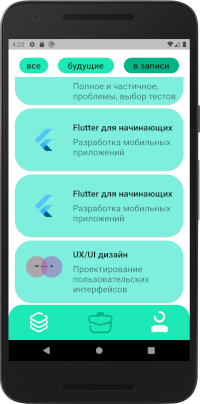
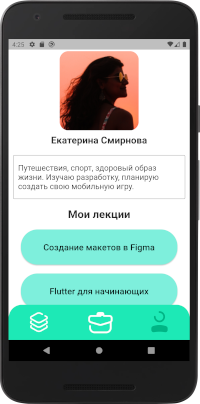
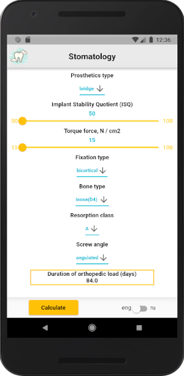

# Portfolio

GitHub: [sv-makh](https://github.com/sv-makh/)

## Projects

[ShEx](#shex---share-experience)

[Dent-App](#dentapp)

### ShEx - Share experience

Repository: [https://github.com/sv-makh/team15](https://github.com/sv-makh/team15)

Приложение - проект образовательного комьюнити для обмена опытом:

Кураторы предлагают лекции, распределённые по подкатегориям.
На отдельных вкладках список лекций (с возможностью выбора прошедших/будущих лекций) и профиль пользователя.

Скриншоты:

  

 

### DentApp

Repository: [https://github.com/sv-makh/dent-app](https://github.com/sv-makh/dent-app)

Приложение-калькулятор для расчёта срока ортопедической нагрузки. 
Расчёт производится на сервере, взаимодействие с сервером по REST API.

Скриншоты:

 