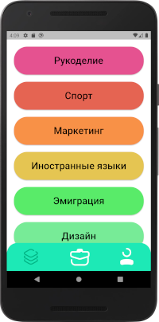
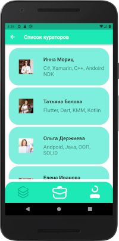

# ShEx - Share experience

Repository: [https://github.com/sv-makh/team15](https://github.com/sv-makh/team15)

Приложение - проект образовательного комьюнити для обмена опытом:

Кураторы предлагают лекции, распределённые по подкатегориям.
На отдельных вкладках список лекций (с возможностью выбора прошедших/будущих лекций) и профиль пользователя.

Скриншоты:

  

 